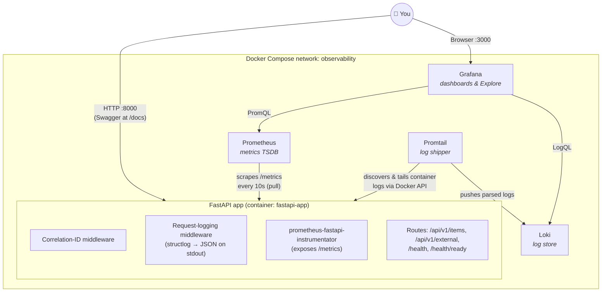

# FastAPI Observability Stack

Learn **logging, metrics, and observability** hands-on: a FastAPI service instrumented with structured JSON logging and Prometheus metrics, shipping logs to **Loki** via **Promtail**, metrics to **Prometheus**, and visualizing both in **Grafana** — all wired together with Docker Compose.

> 📖 **Full learning guide:** [PRD.md](PRD.md) walks through every file, every config decision, and PromQL/LogQL query examples. This README is just the quickstart.

## Architecture



## Quickstart

```bash
# Start everything (build takes ~1 min the first time)
docker compose up --build -d

# Generate some traffic (the /external endpoint fails ~10% of the time on purpose)
for i in $(seq 1 20); do
  curl -s -X POST localhost:8000/api/v1/items \
    -H 'Content-Type: application/json' -d '{"name": "widget-'$i'"}' > /dev/null
  curl -s localhost:8000/api/v1/external > /dev/null
done
```

Then open:

| Service | URL | Notes |
|---|---|---|
| FastAPI (Swagger) | http://localhost:8000/docs | Try the endpoints interactively |
| Raw metrics | http://localhost:8000/metrics | What Prometheus scrapes |
| Prometheus | http://localhost:9090 | Try PromQL in the query box |
| Grafana | http://localhost:3000 | Login `admin` / `admin` → dashboard **FastAPI › FastAPI Overview** |
| Loki (API only) | http://localhost:3100/ready | No UI — query it through Grafana |

Tear down with `docker compose down` (add `-v` to also wipe stored metrics/logs/dashboards).

## Local development (no Docker)

```bash
uv sync
uv run uvicorn app.main:app --reload --port 8000
```

## Try these first

**PromQL** (Grafana → Explore → Prometheus):

```promql
sum(rate(http_requests_total[5m])) by (handler)
histogram_quantile(0.95, sum(rate(http_request_duration_seconds_bucket[5m])) by (le, handler))
```

**LogQL** (Grafana → Explore → Loki):

```logql
{container="fastapi-app"} | json | level="error"
{container="fastapi-app"} | json | duration_ms > 200
```

**The core workflow to practice:** spot a spike in the 5xx panel → note the time window → switch to Loki and filter `status_code >= 500` → grab one `request_id` → filter to that ID and read the whole story of that single failing request.

## Project structure

```
app/
├── main.py                  # App factory: wires middleware, metrics, routers
├── api/routes.py            # Business routes + /health + /health/ready
├── core/
│   ├── config.py            # pydantic-settings (.env-driven)
│   ├── logging.py           # structlog → JSON on stdout (uvicorn logs too)
│   └── metrics.py           # instrumentator setup + custom business metrics
├── middleware/
│   ├── correlation.py       # X-Request-ID in, through logs, and back out
│   ├── logging.py           # One structured log line per request
│   └── metrics.py           # Hand-rolled alternative (educational, not wired in)
└── services/example.py      # Toy business logic emitting logs + custom metrics
monitoring/
├── prometheus/prometheus.yml
├── loki/loki-config.yml
├── promtail/promtail-config.yml
└── grafana/provisioning/    # Auto-configured datasources + dashboard
```